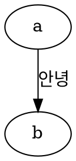

# Langchain/Langgraph Lab
나도 AI를 만들고 싶다!

## 프로젝트 구조
- langchain : 랭체인 관련 연습용 코드
- langgraph : 랭그래프 관련 연습용 코드
- pdf : 연습용 코드 실행을 위한 샘플 PDF 파일
- pdf_parser : PDF 파싱 연습용 코드
- developer_news : 개발자 뉴스레터 중에서, 뉴스레터 기반의 챗봇 만들기

## 도움이 되는 Tool
### 1. graphviz
graph visualization tool.
- [공식문서](https://graphviz.org/about/)
- [간단 사용법](https://wikidocs.net/180842)

설치
```shell
brew install graphviz
```

`graph_visual_test.dot` 파일을 작성


작성한 dot 파일 기반으로 그래프 시각화한 이미지 생성
```shell
dot -Tpng graph_visual_test.dot > graph_visual_test.png
```

결과 이미지 확인 (https://wikidocs.net/180842)


